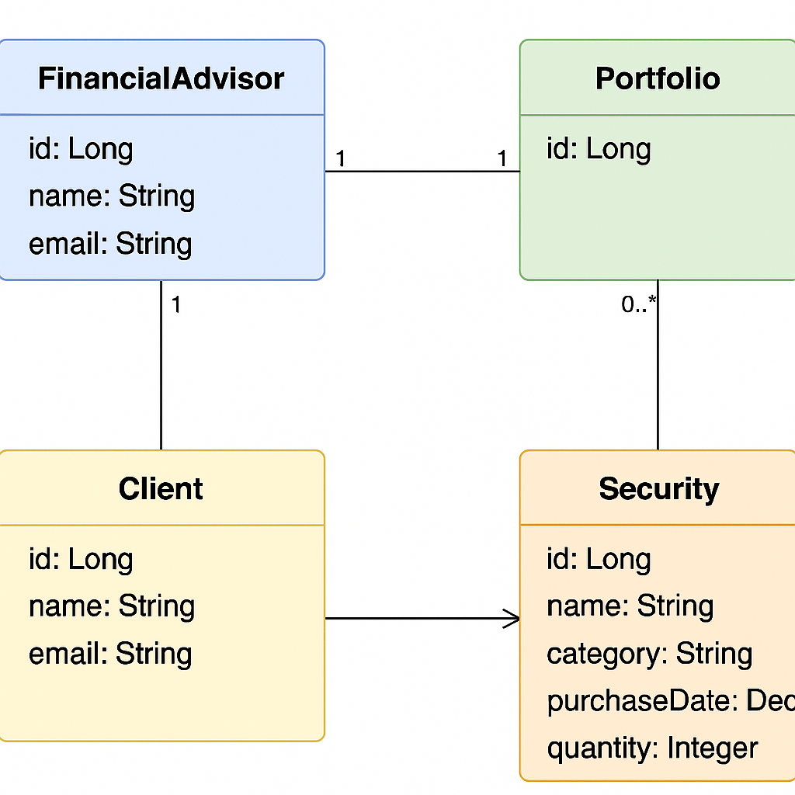

# Wells Fargo – Data Model Implementation

## 📌 Overview
This project is part of the **Wells Fargo Software Engineering Virtual Experience**.  
The objective was to implement a data model in a Spring Boot application based on the provided schema.

## 🎯 Objectives
- Implement entity classes based on the given UML/data model.
- Configure JPA annotations for persistence.
- Maintain clean, modular code structure following best practices.
## UML Diagram


## 📂 Project Structure
```
.mvn/wrapper/                         # Maven wrapper files
src/main/java/com/wellsfargo/counselor/
    ├── entities/                     # Implemented entity classes
    └── other project classes         # Supporting application code
.gitignore
mvnw                                  # Maven wrapper script (Linux/Mac)
mvnw.cmd                              # Maven wrapper script (Windows)
pom.xml                               # Maven build configuration
README.md                             # Project documentation
```

## 🛠 Technologies Used
- Java
- Spring Boot
- Maven
- JPA / Hibernate
- IntelliJ IDEA

## 🚀 Getting Started
### 1️⃣ Clone the repository
```bash
git clone https://github.com/VidweshK182/Wells-Fargo.git
```
### 2️⃣ Navigate to the project folder
```bash
cd Wells-Fargo
```
### 3️⃣ Run the application
```bash
./mvnw spring-boot:run   # For Linux/Mac
mvnw.cmd spring-boot:run # For Windows
```

## 📜 Task Summary
- Fork and clone the provided starter repository.
- Create entity classes in `src/main/java/com/wellsfargo/counselor/entities`.
- Annotate each class with:
  - `@Entity` for persistence.
  - `@GeneratedValue` for primary key IDs.
  - `@Column` or appropriate relationship annotations.
- Include:
  - Constructor to initialize fields.
  - Getters and setters for all attributes (excluding ID setter).
- Use the sample entity as a reference.
- Commit and push changes to your repository.
  
